This project was bootstrapped with [Create React App](https://github.com/facebook/create-react-app).

## Mission Command Control Application

A full-stack dashboard for space exploration data — space agencies, live spacecraft
tracking, and mission information — built by a space exploration enthusiast and
backed by real public APIs and a custom AWS backend rather than static content.

### Features

- **World Space Agencies** — profiles for NASA, ESA, ISRO, JAXA, CNSA, Roscosmos,
  SpaceX, Blue Origin, Virgin Galactic, and Boeing, each with real satellites/
  spacecraft, launch vehicles, and launch centers (backed by DynamoDB), plus a
  downloadable PDF mission report per agency.
- **Live space-object tracking** — three real-time trackers on Google Maps: the
  **ISS** (Open Notify), the **Chinese Space Station/Tiangong** (N2YO, proxied and
  cached through the backend to protect API quota), and the **Deep Space Network**
  (NASA/JPL's live DSN Now feed — which antennas at Goldstone, Madrid, and Canberra
  are tracking which spacecraft right now, with live signal data).
- **Moon Exploration** — live lunar phase/illumination data from the US Naval
  Observatory, and real upcoming lunar missions (Blue Moon, VIPER, LUPEX, etc.)
  from Launch Library 2.
- **NASA content** — Astronomy Picture of the Day and Mars rover photos via
  `api.nasa.gov`, plus SpaceX launch data.
- **AI Assistant** — a streaming chat interface backed by a companion agent service
  (FastAPI + LangGraph + Claude) that can answer questions, search the web, and
  reference uploaded documents. See the [AI Assistant](#ai-assistant) section below.
- **Authentication** — real AWS Cognito-backed login, not a hardcoded credential.

Special thanks to the public APIs and data sources this project relies on:
NASA Open APIs, ISRO's public API, Open Notify (ISS location), N2YO (satellite
tracking), JPL's DSN Now feed, the US Naval Observatory, and Launch Library 2.

## Technologies

- **Frontend:** React, react-router, Ant Design, Google Maps JavaScript API
- **Backend:** Node.js + Express
- **Data:** AWS DynamoDB, AWS S3 + CloudFront (static UI assets), AWS Cognito (auth)
- **AI companion:** a separate FastAPI/LangGraph service (Anthropic Claude, OpenAI
  embeddings, Tavily search, Postgres/pgvector, Redis, Celery) — its own repo,
  talked to directly over HTTP/SSE
- **PDF export:** jsPDF + html2canvas

## Architecture

How the pieces fit together: the React frontend, its Express backend, AWS, the
public space-data APIs it reads live, and the companion AI agent service.

```mermaid
flowchart TD
    subgraph Browser["Browser — React SPA (:3000)"]
        Shell["App.js router shell"]
        Login["Login"]
        Trackers["Live Trackers<br/>ISS · Chinese Space Station · Deep Space Network"]
        Agencies["Agencies & Posts<br/>Dashboard · CreatePost · AllPosts"]
        Content["NASA · Planets · SpaceX"]
        Moon["Moon Exploration"]
        AI["AI Assistant"]
        Shell --> Login & Trackers & Agencies & Content & Moon & AI
    end

    subgraph Backend["Express backend — app.js (:3100)"]
        RLogin["POST /login"]
        RData["/agencies · /spacecrafts · /posts"]
        RTiangong["/chineseTiangong<br/>(30s shared cache)"]
        RImages["/api/images"]
    end

    subgraph AWS["AWS"]
        Cognito["Cognito User Pool"]
        DynamoDB["DynamoDB"]
        S3["S3<br/>spaceagencies bucket"]
        CloudFront["CloudFront<br/>static UI images"]
        CloudFront -->|ui-assets/ prefix| S3
    end

    subgraph PublicAPIs["Public APIs"]
        N2YO["N2YO"]
        NasaAPI["NASA Open APIs"]
        SpaceXAPI["SpaceX API"]
        OpenNotify["Open Notify (ISS)"]
        DSNFeed["JPL DSN Now feed"]
        GMaps["Google Maps JavaScript API"]
        USNO["US Naval Observatory<br/>(Moon phase)"]
        LL2["Launch Library 2<br/>(lunar missions)"]
    end

    subgraph Agent["rockets-and-space — separate repo (:8000)"]
        FastAPI["FastAPI + LangGraph agent"]
        Ingest["Ingestion pipeline<br/>Celery · Redis · Postgres/pgvector · MinIO"]
        Claude["Anthropic Claude"]
        OpenAI["OpenAI embeddings"]
        Tavily["Tavily search"]
        FastAPI --> Claude
        FastAPI --> Tavily
        FastAPI --> Ingest
        Ingest --> OpenAI
    end

    Login -->|POST| RLogin
    Agencies -->|CRUD, JSON| RData
    Agencies -->|GET| RImages
    Trackers -->|GET, cached| RTiangong
    Trackers -.-> OpenNotify
    Trackers -.-> DSNFeed
    Trackers -.-> GMaps
    Content -.-> NasaAPI
    Content -.-> SpaceXAPI
    Moon -.->|GET, 1h cache| USNO
    Moon -.->|GET, 1h cache| LL2
    Shell -.->|flags, logos, planets, etc.| CloudFront
    AI -->|SSE| FastAPI

    RLogin -->|AdminInitiateAuth| Cognito
    RData -->|via dynamodb.js| DynamoDB
    RImages -->|presigned URLs| S3
    RTiangong --> N2YO
```

Solid arrows are network calls; dashed arrows are public APIs (or the static
asset CDN) called directly from the browser rather than through the Express
backend. Static UI images (flags, agency logos, planet renders, carousel
photos) are pulled from CloudFront at build/render time via
`src/constants/assetUrls.js` — the `/api/images` route above is a separate,
unrelated feature (a dynamic photo gallery using presigned URLs against the
same bucket's default prefix).

## AI Assistant

The app now includes an AI Assistant page (click the robot icon in the nav, or go to
`/ai-assistant`) — a chat interface for asking about rockets, space missions, and
uploaded documents. It's powered by a separate project,
[rockets-and-space](https://github.com/Creative9991/rockets-and-space) (Next.js +
FastAPI/LangGraph agent backend), which this app talks to directly over HTTP/SSE —
Mission Control's React frontend is just a second client of that API, same as
rockets-and-space's own frontend.

**To use it locally:**

1. Clone and run `rockets-and-space` per its own README (`docker compose up --build`,
   with `ANTHROPIC_API_KEY` set in its `.env`). It serves its API at
   `http://localhost:8000` by default.
2. In this repo, copy `.env.example` to `.env` (defaults already point at
   `http://localhost:8000` — only change `REACT_APP_AI_API_URL` if rockets-and-space
   is running somewhere else).
3. `npm start` as usual — the AI Assistant page will stream chat responses once both
   apps are running.

Note: as of now, rockets-and-space's API has no authentication of its own — the AI
Assistant page here is only gated by this app's existing login, not by the backend
itself. Don't point `REACT_APP_AI_API_URL` at a publicly deployed instance without
adding real auth + rate limiting first.

## Available Scripts

In the project directory, you can run:

### `npm start`

Runs the app in the development mode. 
Open [http://localhost:3000](http://localhost:3000) to view it in the browser.

The page will reload if you make edits. 
You will also see any lint errors in the console.

